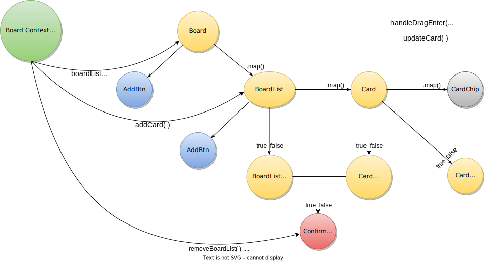
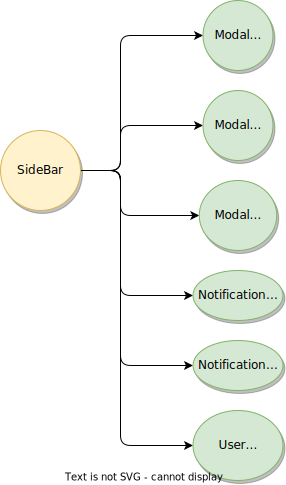

> 21 - Jun - 2022

# Space Clone | [Live Link](https://space.makereal.click)


## Yarn | Project Dependencies...
|No| Package Installs               | Usage for                                 |
|--|--------------------------------|-------------------------------------------|
| 1| yarn add `react-route-dom`     | Declarative routing in react web app      |
| 2| yarn add `react-icons`         | Icon pack for interactive UI building     |
| 3| yarn add `axios`               | Data fetching from backend                |
| 4| yarn add `-D` `tailwindcss postcss autoprefixer` | `devDependency` of TailwindCSS for building UI  |
| 5| yarn add `@tippyjs/react`          | Tool tip for extra little info at UI  |
| 6| yarn add `@giphy/react-components` | GIF for chatting UI                   |
| 7| yarn add `react-toastify`          | [Popup Toast Notification][tostDoc]   |
| 8| yarn add `react-redux`             | globally data/state management        |
| 9| yarn add `@reduxjs-toolkit`        | globally data/state management        |
|10| yarn add `lodash`                  | Javascript helper methods             |
|11| yarn add `date-fns`                | Date manager                          |
|12| yarn add `reactjs-popup`           | Managing popups                       |
|14| yarn add `react-google-login`      | Google Login component                |
|15| yarn add `gapi-script`             | Google API Script                     |


[tostDoc]: https://fkhadra.github.io/react-toastify/introduction
 

### [React Icons | Web Link][link]
[link]: https://react-icons.github.io/react-icons


## Parent Child - Components Relationship - Inside Component Tree...
<p align="center"> 
  
</p>

## Board Section Component Relationship + Data Flow
<p align="center"> 
  
</p>

</p>

## Sidebar Section Component Relationship + Data Flow
<p align="center"> 
  
</p>


## Project Folder & File Structure 
```jsx

    ├───public
    │   ├───heySpace.ico
    │   ├───index.html
    │   └───_redirects
    │
    ├───src
    │   ├───App.js
    │   ├───index.js
    │   ├───colors.json
    │   ├───assets
    │   │   ├───icons
    │   │   │   ├───svg
    │   │   │   │   ├───Addons.jsx
    │   │   │   │   ├───ArrowLeft.jsx
    │   │   │   │   ├───ArrowRight.jsx
    │   │   │   │   ├───Attachment.jsx
    │   │   │   │   ├───AtTheRate.jsx
    │   │   │   │   ├───Bell.jsx
    │   │   │   │   ├───Calendar.jsx
    │   │   │   │   ├───CheckList.jsx
    │   │   │   │   ├───Close.jsx
    │   │   │   │   ├───CloseMenuBtn.jsx
    │   │   │   │   ├───Copy.jsx
    │   │   │   │   ├───Delete.jsx
    │   │   │   │   ├───Description.jsx
    │   │   │   │   ├───DotsDouble.jsx
    │   │   │   │   ├───DotsSingle.jsx
    │   │   │   │   ├───EditPen.jsx
    │   │   │   │   ├───Eye.jsx
    │   │   │   │   ├───EyeOpen.jsx
    │   │   │   │   ├───Folder.jsx
    │   │   │   │   ├───GIF.jsx
    │   │   │   │   ├───LinkingChain.jsx
    │   │   │   │   ├───LogOut.jsx
    │   │   │   │   ├───Mobile.jsx
    │   │   │   │   ├───OpenMenuBtn.jsx
    │   │   │   │   ├───OverWatch.jsx
    │   │   │   │   ├───Plus.jsx
    │   │   │   │   ├───RightArrow.jsx
    │   │   │   │   ├───RightOK.jsx
    │   │   │   │   ├───Search.jsx
    │   │   │   │   ├───Settings.jsx
    │   │   │   │   ├───Smile.jsx
    │   │   │   │   ├───SMS.jsx
    │   │   │   │   ├───SpaceLogoLock.jsx
    │   │   │   │   ├───SpaceLogo.jsx
    │   │   │   │   ├───Subscription.jsx
    │   │   │   │   ├───Tag.jsx
    │   │   │   │   ├───Task.jsx
    │   │   │   │   └───UserPlus.jsx
    │   │   │   │   
    │   │   │   └───index.js
    │   │   │
    │   │   ├───images
    │   │   │   ├───defaultList.png
    │   │   │   ├───haySpace.png
    │   │   │   ├───loginPage.png
    │   │   │   ├───logo.png
    │   │   │   ├───Mahbub.jpg
    │   │   │   ├───makeReal.png
    │   │   │   ├───remoteCamp.png
    │   │   │   ├───signIn1.png
    │   │   │   ├───signIn2.png
    │   │   │   ├───timeCamp.png
    │   │   │   ├───userLogin.png
    │   │   │   └───user.jpg
    │   │   │
    │   │   ├───ComponentsTree.svg
    │   │   │
    │   │   └───index.js
    │   │
    │   ├───components
    │   │   ├───AddCard.jsx
    │   │   ├───AddCardButton.jsx
    │   │   ├───AddCardMini.jsx
    │   │   ├───Calender.jsx
    │   │   ├───index.js
    │   │   ├───List.jsx
    │   │   ├───PageNotFound.jsx
    │   │   ├───Timeline.jsx
    │   │   ├───Button.jsx
    │   │   ├───Dropdown.jsx
    │   │   ├───Input.jsx
    │   │   ├───Loader.jsx
    │   │   │
    │   │   ├───Board
    │   │   │   ├───AddBtn.jsx
    │   │   │   ├───Board.jsx
    │   │   │   ├───BoardList.jsx
    │   │   │   ├───BoardListSettingDropDown.jsx
    │   │   │   ├───Card.jsx
    │   │   │   ├───CardChip.jsx
    │   │   │   ├───CardModal.jsx
    │   │   │   ├───CardSettingDropDown.jsx
    │   │   │   ├───ConfirmDialog.jsx
    │   │   │   └───index.js
    │   │   │
    │   │   ├───Chat
    │   │   │   ├───Chat.jsx
    │   │   │   ├───GIF.jsx
    │   │   │   ├───MessageBox.jsx
    │   │   │   └───TextMessage.jsx
    │   │   │
    │   │   ├───Layout
    │   │   │   ├───Layout.js
    │   │   │   └───UserSettingLayout.jsx
    │   │   │
    │   │   ├───LoginRegistration
    │   │   │   ├───Login.jsx
    │   │   │   └───Register.jsx
    │   │   │
    │   │   ├───Navbar
    │   │   │   ├───AddOn.jsx
    │   │   │   ├───Members.jsx
    │   │   │   ├───NavBar.jsx
    │   │   │   └───Setting.jsx
    │   │   │
    │   │   ├───Sidebar
    │   │   │   ├───index.js
    │   │   │   ├───ModalSearchSpace.jsx
    │   │   │   ├───ModalSpaceCreate.jsx
    │   │   │   ├───ModalWorkSpaceCreate.jsx
    │   │   │   ├───NotificationBell.jsx
    │   │   │   ├───NotificationSMS.jsx
    │   │   │   ├───SideBar.jsx
    │   │   │   └───UserSettingsDropDown.jsx
    │   │   │
    │   │   └───UserSettings
    │   │       ├───DeveloperConsole.jsx
    │   │       ├───ManageWorkspace.jsx
    │   │       ├───Preferences.jsx
    │   │       ├───Profile.jsx
    │   │       ├───Tag.jsx
    │   │       ├───CreateTagModal.jsx
    │   │       ├───DeleteTagModal.jsx
    │   │       └───UserSettings.jsx
    │   │
    │   ├───constant
    │   │   ├───data.js
    │   │   └───users.js
    │   │
    │   ├───context
    │   │   ├───BoardCardContext.js
    │   │   └───StyleContext.js
    │   │
    │   ├───hooks
    │   │   └───useFetch.js
    │   │
    │   ├───style
    │   │   └───index.css
    │   │
    │   └───util
    │       ├───date.js
    │       ├───helpers.js
    │       └───fetchUserToken.js
    │
    ├───.gitignore
    ├───package-lock.json
    ├───package.json
    ├───postcss.config.js
    ├───README.md
    ├───tailwind.config.js
    └───yarn.lock
    
```